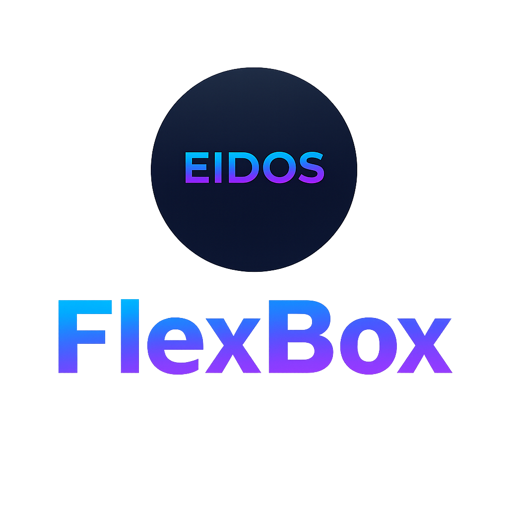

# FlexBox

  

Welcome to the documentation for **Eidos FlexBox**. This is the landing page that guides users to quickstart
instructions, API reference, examples, troubleshooting and support.

- [FlexBox](#flexbox)
  - [Overview](#overview)
  - [Installation](#installation)
  - [Quickstart (UMG Designer)](#quickstart-umg-designer)
    - [FlexContainer Properties](#flexcontainer-properties)
    - [FlexChild Properties (per child)](#flexchild-properties-per-child)
  - [Blueprints](#blueprints)
  - [C++](#c)

## Overview

**Eidos FlexBox** is a responsive layout container inspired by CSS Flexbox. It provides a predictable, game-friendly way
to align, distribute, wrap and size UMG children both at design time and runtime.

Key capabilities:

* Horizontal and Vertical flow
* Justify / Align options
* Per-child overrides (align-self, margin, optional flex-grow/shrink)
* Wrap support (single-line or multi-line)
* Padding, and margins
* Blueprint and C++ friendly API
* Runtime-safe and efficient updates

---

## Installation

1. Copy the `EidosFlexBox` plugin folder into your project's `Plugins/` directory (or the Engine `Plugins/` folder if you
   prefer).
2. Open your project in the Unreal Editor. If prompted, rebuild plugin modules.
3. Enable the plugin from **Edit > Plugins** (search for "Flexbox"), then restart the editor if requested.

---

## Quickstart (UMG Designer)

Follow these steps to start using Flexbox in UMG Designer.

1. **Create a new Widget Blueprint** (or open an existing one).
2. In the **Palette**, find `EidosFlexBox` (under the plugin or user widgets category) and drag it into the **Hierarchy**.
3. Select the `EidosFlexBox` and in the **Details** panel locate the **FlexBox** section. To learn about each
   property of the container, you can check this [CSS Flexbox guide](https:https://css-tricks.com/snippets/css/a-guide-to-flexbox/)
   and read about Properties for the Parent (flex container).
4. Add child widgets inside the `EidosFlexBox` (e.g., Text, Image, Buttons).
5. For a child widget, in **Details** find **FlexBox** properties. You can check Properties for the Children
   (flex items) to learn about each property of the child.
6. Preview the widget in the Designer and use different screen DPI presets to validate responsiveness.
7. Save the widget and use it in your game.

### FlexContainer Properties

* `FlowDirection` — Horizontal / Vertical / HorizontalReverse / VerticalReverse
* `WrapEnabled` — Bool
* `JustifyContent` — Start / Center / End / SpaceBetween / SpaceAround
* `AlignItems` — Start / Center / End / Stretch
* `GapX`, `GapY` — float
* `Padding` — FMargin
* `RebuildOnTick` — (usually false) controls automatic rebuild; avoid enabling unless necessary

### FlexChild Properties (per child)

* `Margin` — FMargin
* `AlignSelf` — Auto / Start / Center / End / Stretch
* `FlexGrow` — float (optional)

---

## Blueprints

Once your widget has an EidosFlexBox Container and some children, you can change their properties at runtime using Blueprints. 
All the functions of both the container and the children are exposed to Blueprints

Go to [the Blueprints section](blueprints.md) to check all of those.

---

## C++

Both the container and the children can be fully managed in C++. 

You can see further explanations in [the C++ section](cpp.md).
